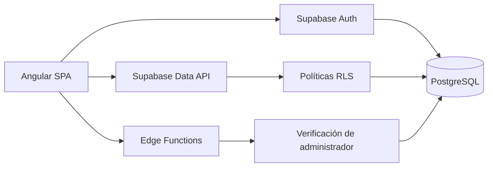

<div align="center">
  

# Sistema Empresa Mangata SPA

**Plataforma web de gestión empresarial para usuarios, productos, pedidos y reportes.**

[](https://angular.dev/)
[](https://www.typescriptlang.org/)
[](https://supabase.com/)
[](https://vitest.dev/)

Aplicación desarrollada para centralizar la operación diaria de **Mangata SPA** mediante una interfaz clara, segura y orientada a pequeñas empresas.
</div>

---

## Tabla de contenidos

- [Descripción](#descripción)
- [Características principales](#características-principales)
- [Roles y permisos](#roles-y-permisos)
- [Tecnologías](#tecnologías)
- [Arquitectura](#arquitectura)
- [Modelo de datos](#modelo-de-datos)
- [Seguridad](#seguridad)
- [Rutas de la aplicación](#rutas-de-la-aplicación)
- [Instalación y ejecución](#instalación-y-ejecución)
- [Configuración de Supabase](#configuración-de-supabase)
- [Pruebas y calidad](#pruebas-y-calidad)
- [Documentación funcional](#documentación-funcional)
- [Convenciones del proyecto](#convenciones-del-proyecto)

## Descripción

**Sistema Empresa Mangata SPA** es una Single Page Application que permite gestionar el flujo operacional de la empresa desde un único lugar. Integra autenticación, administración de usuarios, catálogo de productos, seguimiento completo de pedidos y generación de reportes.

El frontend está construido con Angular y formularios reactivos. Supabase proporciona autenticación, PostgreSQL, funciones RPC, Row Level Security y Edge Functions para las operaciones administrativas que requieren privilegios de servidor.

La aplicación prioriza:

- Facilidad de uso para personas con distintos niveles de experiencia digital.
- Validaciones claras y mensajes comprensibles.
- Separación de responsabilidades por módulos.
- Protección de información mediante autenticación, guards y políticas RLS.
- Integridad de precios, pedidos e historial de estados.
- Diseño profesional, responsivo y sin dependencias de frameworks visuales pesados.

## Características principales

### Usuarios y autenticación

- Inicio y cierre de sesión mediante Supabase Auth.
- Recuperación y restablecimiento seguro de contraseña por correo.
- Consulta y edición del perfil personal.
- Validación y normalización de nombres, apellidos, RUT, correo y teléfono.
- Administración de usuarios y roles.
- Registro seguro mediante una Edge Function, sin exponer `service_role` en Angular.
- Creación rápida de clientes sin acceso inicial durante el registro de pedidos.
- Protección de la cuenta propia y del último administrador del sistema.
- Plantillas de correo transaccional personalizadas para Mangata.

### Productos

- Catálogo con búsqueda y filtros por categoría y estado.
- Registro y edición de productos.
- Categorías normalizadas: trofeo, medalla, placa, figura 3D, llavero y otros.
- Precio base, material, descripción e imagen referencial.
- Activación y desactivación lógica de productos.
- Acceso de solo lectura para trabajadores y clientes.

### Pedidos

- Registro de pedidos asociados a clientes.
- Creación rápida de un cliente desde el formulario del pedido.
- Inclusión de múltiples productos, cantidades y personalizaciones.
- Cálculo automático de subtotales y total general.
- Conservación del precio histórico utilizado en cada pedido.
- Búsqueda por número de pedido o cliente y filtrado por estado.
- Edición administrativa, incluso para corregir pedidos finalizados.
- Actualización de estados por administradores y trabajadores.
- Historial automático con estado anterior, estado nuevo, fecha, responsable y observación.
- Consulta del historial completo de pedidos por cliente.

Estados disponibles:

```text
RECIBIDO → EN_REVISION → EN_PRODUCCION → LISTO → ENTREGADO
                                                ↘ CANCELADO
```

El sistema permite corregir el estado cuando se haya seleccionado uno incorrecto; cada cambio queda registrado en el historial.

### Reportes

- Panel exclusivo para administradores.
- Indicadores de total de pedidos, pendientes, entregados y ventas.
- Distribución de pedidos por estado.
- Ranking de productos más solicitados.
- Evolución de ventas por periodo.
- Filtros por rango de fechas, estado y producto.
- Selector de productos con búsqueda escrita en tiempo real.
- Exportación del reporte a PDF mediante jsPDF y AutoTable.
- Consultas agregadas protegidas mediante funciones PostgreSQL.

## Roles y permisos

| Funcionalidad                        | Administrador | Trabajador |   Cliente    |
| ------------------------------------ | :-----------: | :--------: | :----------: |
| Consultar y editar su perfil         |      ✅       |     ✅     |      ✅      |
| Gestionar usuarios y roles           |      ✅       |     —      |      —       |
| Consultar productos                  |      ✅       |     ✅     |      ✅      |
| Crear, editar o desactivar productos |      ✅       |     —      |      —       |
| Consultar pedidos                    |     Todos     |   Todos    | Solo propios |
| Crear o editar pedidos               |      ✅       |     —      |      —       |
| Actualizar estados de pedidos        |      ✅       |     ✅     |      —       |
| Consultar historial de clientes      |      ✅       |     ✅     |      —       |
| Visualizar y exportar reportes       |      ✅       |     —      |      —       |

Los permisos visuales del frontend se complementan con políticas RLS y funciones seguras en PostgreSQL. Ocultar un botón no se considera una medida de seguridad por sí sola.

## Tecnologías

| Capa                 | Tecnología              | Uso principal                                  |
| -------------------- | ----------------------- | ---------------------------------------------- |
| Frontend             | Angular 21              | Componentes standalone, routing y vistas       |
| Lenguaje             | TypeScript 5.9          | Tipado estricto y lógica de aplicación         |
| Formularios          | Angular Reactive Forms  | Validación y normalización de datos            |
| Estilos              | HTML + CSS directo      | Diseño visual responsivo y reutilizable        |
| Reactividad          | Angular Signals + RxJS  | Estado de sesión, perfil y pantallas           |
| Backend              | Supabase                | Auth, API, funciones y servicios administrados |
| Base de datos        | PostgreSQL 17           | Persistencia, reglas de negocio y reportes     |
| Seguridad            | Row Level Security      | Autorización por usuario y rol                 |
| Backend privilegiado | Supabase Edge Functions | Alta y administración segura de usuarios       |
| Gráficos             | Chart.js                | Visualización de indicadores y tendencias      |
| PDF                  | jsPDF + jsPDF-AutoTable | Exportación de reportes                        |
| Pruebas              | Vitest + jsdom          | Pruebas unitarias y de componentes             |

## Arquitectura

El código está organizado por responsabilidades y dominios funcionales:

```text
Sistema-Empresa-Mangata-SPA/
├── public/
│   └── assets/                     # Logo y recursos estáticos
├── src/
│   ├── app/
│   │   ├── core/
│   │   │   ├── guards/             # Autenticación y autorización por rol
│   │   │   └── services/           # Cliente Supabase y sesión global
│   │   ├── features/
│   │   │   ├── usuarios/           # Auth, perfil y administración
│   │   │   ├── productos/          # Catálogo y mantenimiento
│   │   │   ├── pedidos/            # Pedidos, clientes e historial
│   │   │   └── reportes/           # Indicadores, gráficos y PDF
│   │   ├── shared/
│   │   │   ├── components/         # Layout principal
│   │   │   ├── enums/              # Roles, estados y categorías
│   │   │   └── validators/         # Validaciones reutilizables
│   │   └── app.routes.ts
│   ├── environments/               # Configuración pública del frontend
│   └── styles.css                  # Estilos globales y variables visuales
├── supabase/
│   ├── functions/                  # Edge Functions administrativas
│   ├── migrations/                 # Esquema, RLS, funciones y políticas
│   ├── templates/                  # Correos de autenticación
│   ├── config.toml                 # Configuración local de Supabase
│   └── seed.sql                    # Datos de desarrollo
└── docs/                           # Historias, requisitos y modelo ER
```

### Flujo general



Angular utiliza una única instancia compartida del cliente de Supabase. Las operaciones normales pasan por la API con la sesión del usuario; las acciones privilegiadas de Auth se ejecutan exclusivamente dentro de Edge Functions.

## Modelo de datos

```mermaid
erDiagram
    AUTH_USERS ||--|| PERFIL : "identifica"
    PERFIL ||--o{ PEDIDO : "realiza"
    PEDIDO ||--|{ DETALLE_PEDIDO : "contiene"
    PRODUCTO ||--o{ DETALLE_PEDIDO : "se incluye en"
    PEDIDO ||--o{ HISTORIAL_PEDIDO : "registra"
    PERFIL ||--o{ HISTORIAL_PEDIDO : "actualiza"

    PERFIL {
        uuid id PK_FK
        varchar nombre
        varchar apellido
        varchar rut UK
        varchar correo UK
        varchar telefono
        varchar rol
    }
    PRODUCTO {
        bigint id PK
        varchar nombre
        varchar categoria
        numeric precio_base
        boolean activo
    }
    PEDIDO {
        bigint id PK
        varchar numero_pedido UK
        uuid cliente_id FK
        varchar estado
        date fecha_solicitud
        date fecha_entrega
        numeric total
    }
    DETALLE_PEDIDO {
        bigint id PK
        bigint pedido_id FK
        bigint producto_id FK
        integer cantidad
        numeric precio_unitario
        numeric subtotal
    }
    HISTORIAL_PEDIDO {
        bigint id PK
        bigint pedido_id FK
        uuid usuario_id FK
        varchar estado_anterior
        varchar estado_nuevo
        timestamptz created_at
    }
```

`perfil.id` es simultáneamente clave primaria y clave foránea hacia `auth.users.id`. Supabase Auth administra las credenciales; `public.perfil` conserva únicamente la información empresarial complementaria.

## Seguridad

La seguridad está aplicada en varias capas:

1. **Supabase Auth** administra credenciales, sesiones y recuperación de contraseña.
2. **Guards de Angular** protegen las rutas y redirigen según autenticación y rol.
3. **Row Level Security** restringe directamente el acceso a las tablas.
4. **Funciones PostgreSQL `security definer`** encapsulan operaciones complejas y validan permisos.
5. **Edge Functions** protegen las operaciones de administración de Supabase Auth.
6. **Triggers y restricciones SQL** preservan integridad, roles, RUT, fechas y datos históricos.
7. **Reactive Forms** impiden el envío de datos incompletos o inválidos desde la interfaz.

> [!IMPORTANT]
> La clave `service_role` y las credenciales SMTP nunca deben incluirse en Angular, archivos `environment.ts`, commits ni documentación. El frontend utiliza exclusivamente una clave pública/publishable de Supabase.

## Rutas de la aplicación

### Rutas públicas

| Ruta                      | Descripción                         |
| ------------------------- | ----------------------------------- |
| `/login`                  | Inicio de sesión                    |
| `/recuperar-contrasena`   | Solicitud de enlace de recuperación |
| `/restablecer-contrasena` | Definición de una nueva contraseña  |

### Rutas autenticadas

| Ruta                    | Acceso                                             |
| ----------------------- | -------------------------------------------------- |
| `/perfil`               | Todos los usuarios autenticados                    |
| `/usuarios`             | Solo administrador                                 |
| `/usuarios/nuevo`       | Solo administrador                                 |
| `/usuarios/:id/editar`  | Solo administrador                                 |
| `/productos`            | Usuarios autenticados                              |
| `/productos/nuevo`      | Solo administrador                                 |
| `/productos/:id/editar` | Solo administrador                                 |
| `/pedidos`              | Usuarios autenticados, con datos limitados por RLS |
| `/pedidos/nuevo`        | Solo administrador                                 |
| `/pedidos/:id`          | Detalle autorizado por RLS                         |
| `/pedidos/:id/editar`   | Solo administrador                                 |
| `/clientes/:id/pedidos` | Administrador y trabajador                         |
| `/reportes`             | Solo administrador                                 |

## Instalación y ejecución

### Requisitos previos

- [Node.js](https://nodejs.org/) 20.19 o superior compatible con Angular 21.
- npm 11 o una versión compatible.
- Git.
- Una instancia de Supabase o Docker Desktop para el entorno local completo.

### 1. Instalar dependencias

```bash
npm install
```

### 2. Configurar el entorno Angular

Configura `src/environments/environment.ts` con los valores públicos del proyecto:

```ts
export const environment = {
  production: false,
  supabaseUrl: 'https://TU_PROYECTO.supabase.co',
  supabaseKey: 'TU_CLAVE_PUBLICA_O_PUBLISHABLE',
};
```

No utilices una clave `service_role` en este archivo.

### 3. Iniciar Angular

```bash
npm start
```

La aplicación estará disponible normalmente en `http://localhost:4200`.

También puedes usar:

```bash
npx ng serve --open
```

### 4. Generar una compilación de producción

```bash
npm run build
```

Los artefactos se generan en `dist/sistema-mangata/`.

## Configuración de Supabase

### Desarrollo local

Con Docker Desktop iniciado:

```bash
npx supabase start
npx supabase db reset
```

Esto levanta los servicios locales, aplica las migraciones y carga `supabase/seed.sql`.

| Servicio local   | Dirección                |
| ---------------- | ------------------------ |
| API              | `http://127.0.0.1:54321` |
| PostgreSQL       | `127.0.0.1:54322`        |
| Supabase Studio  | `http://127.0.0.1:54323` |
| Visor de correos | `http://127.0.0.1:54324` |

Para utilizar el backend local, reemplaza temporalmente la URL y clave pública de `environment.ts` por los valores entregados por `supabase start`.

### Proyecto remoto

Después de autenticar Supabase CLI y vincular el proyecto correcto:

```bash
npx supabase login
npx supabase link --project-ref TU_PROJECT_REF
npx supabase db push
npx supabase functions deploy registrar-usuario
npx supabase functions deploy administrar-usuarios
```

Antes de ejecutar operaciones remotas, revisa siempre el proyecto vinculado y las migraciones pendientes. No ejecutes comandos destructivos sobre una base con información real sin respaldo.

Las Edge Functions esperan estas variables seguras, proporcionadas por Supabase en su entorno:

```text
SUPABASE_URL
SUPABASE_ANON_KEY
SUPABASE_SERVICE_ROLE_KEY
```

### Correos y recuperación de contraseña

La configuración local acepta los retornos:

```text
http://127.0.0.1:4200/restablecer-contrasena
http://localhost:4200/restablecer-contrasena
```

En producción se debe agregar la URL pública equivalente en **Authentication → URL Configuration**. Las plantillas y asuntos están documentados en [docs/configuracion-correos-supabase.md](docs/configuracion-correos-supabase.md).

## Pruebas y calidad

### Pruebas unitarias

```bash
npm test
```

Para una ejecución única apropiada para integración continua:

```bash
npm test -- --watch=false
```

La suite cubre, entre otros aspectos:

- Validación y normalización de datos de usuario.
- Edición parcial de perfiles y usuarios.
- Restricción de reportes por rol.
- Búsqueda y filtrado de usuarios y productos en reportes.
- Cálculo de subtotales y totales de pedidos.
- Validación de formularios de productos y pedidos.
- Utilidades estadísticas y generación de reportes PDF.

### Comprobaciones recomendadas antes de entregar cambios

```bash
npm test -- --watch=false
npm run build
git diff --check
```

## Documentación funcional

La carpeta `docs/` es la fuente principal para el alcance funcional y el modelo del sistema:

- [Historias de usuario](docs/historias_de_usuario_mangata.md): HU-01 a HU-20 y su trazabilidad.
- [Requerimientos funcionales y no funcionales](docs/requerimientos_funcionales_no_funcionales_mangata_corregido.md): RF-01 a RF-12 y RNF-01 a RNF-14.
- [Modelo entidad–relación](docs/modelo_entidad_relacion_mangata_completo.md): entidades, atributos, reglas y cardinalidades.
- [Configuración de correos](docs/configuracion-correos-supabase.md): asuntos, plantillas, SMTP y prueba de recuperación.

## Convenciones del proyecto

| Elemento              | Convención           | Ejemplo                      |
| --------------------- | -------------------- | ---------------------------- |
| Variables y funciones | camelCase en español | `obtenerPerfil()`            |
| Clases e interfaces   | PascalCase           | `PerfilUsuario`              |
| Archivos y carpetas   | kebab-case           | `inicio-sesion.component.ts` |
| Base de datos         | snake_case           | `fecha_solicitud`            |
| Componentes Angular   | Standalone           | `imports` en el componente   |
| Formularios           | Reactive Forms       | `FormGroup`, `FormControl`   |
| Estado local          | Signals              | `signal`, `computed`         |

### Flujo de trabajo Git

- Trabajar en una rama de funcionalidad o corrección.
- Mantener los commits enfocados y descriptivos.
- No incluir secretos, artefactos de compilación ni archivos locales.
- Ejecutar pruebas y build antes de integrar cambios.
- Revisar migraciones y permisos cuando una modificación afecte Supabase.

---

<div align="center">
  <strong>Mangata SPA</strong><br />
  Gestión empresarial clara, segura y centralizada.
</div>
