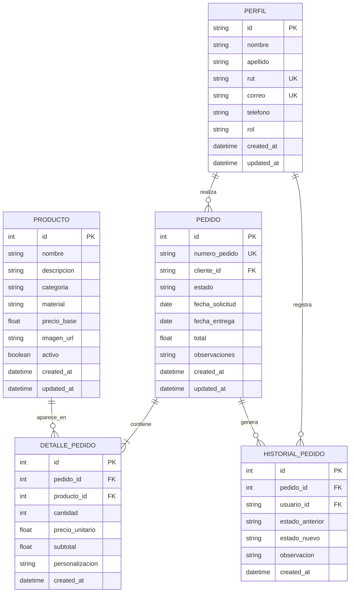

# Modelo Entidad–Relación
## Sistema Empresa Mangata SPA

## 1. Descripción general

El sistema utilizará una base de datos relacional PostgreSQL administrada mediante Supabase.

El modelo inicial estará compuesto por cinco tablas:

1. `perfil`
2. `producto`
3. `pedido`
4. `detalle_pedido`
5. `historial_pedido`

Estas tablas permitirán administrar usuarios, productos, pedidos, productos incluidos en cada pedido y los cambios de estado realizados durante el proceso.

---

## 2. Diagrama entidad–relación



> Nota: Mermaid utiliza tipos simplificados como `string`, `int`, `float` y `datetime` para mostrar correctamente el diagrama. En PostgreSQL se usarán los tipos técnicos indicados en las tablas siguientes.

---

## 3. Entidades

### 3.1. Tabla `perfil`

Almacena los datos complementarios de las personas registradas en el sistema.

El campo `id` utilizará el mismo identificador generado por Supabase Auth en `auth.users.id`.

| Campo | Tipo PostgreSQL | Restricción | Descripción |
|---|---|---|---|
| `id` | `uuid` | PK, FK a `auth.users(id)` | Identificador único del usuario |
| `nombre` | `varchar(100)` | NOT NULL | Nombre del usuario |
| `apellido` | `varchar(100)` | NOT NULL | Apellido del usuario |
| `rut` | `varchar(12)` | UNIQUE, NOT NULL | RUT del usuario |
| `correo` | `varchar(150)` | UNIQUE, NOT NULL | Correo electrónico |
| `telefono` | `varchar(20)` | NULL | Teléfono de contacto |
| `rol` | `varchar(30)` | NOT NULL | Rol dentro del sistema |
| `created_at` | `timestamptz` | DEFAULT `now()` | Fecha de creación |
| `updated_at` | `timestamptz` | DEFAULT `now()` | Fecha de última actualización |

#### Roles iniciales

- `ADMINISTRADOR`
- `TRABAJADOR`
- `CLIENTE`

---

### 3.2. Tabla `producto`

Contiene el catálogo de productos ofrecidos por Mangata Design SPA.

| Campo | Tipo PostgreSQL | Restricción | Descripción |
|---|---|---|---|
| `id` | `bigint` | PK, IDENTITY | Identificador del producto |
| `nombre` | `varchar(150)` | NOT NULL | Nombre del producto |
| `descripcion` | `text` | NULL | Descripción del producto |
| `categoria` | `varchar(50)` | NOT NULL | Categoría del producto |
| `material` | `varchar(100)` | NULL | Material principal |
| `precio_base` | `numeric(12,0)` | NOT NULL, CHECK `>= 0` | Precio referencial |
| `imagen_url` | `text` | NULL | URL de la imagen almacenada |
| `activo` | `boolean` | DEFAULT `true` | Indica si puede utilizarse en nuevos pedidos |
| `created_at` | `timestamptz` | DEFAULT `now()` | Fecha de creación |
| `updated_at` | `timestamptz` | DEFAULT `now()` | Fecha de última actualización |

#### Categorías iniciales

- `TROFEO`
- `MEDALLA`
- `PLACA`
- `FIGURA_3D`
- `LLAVERO`
- `OTRO`

---

### 3.3. Tabla `pedido`

Registra la información general de cada pedido realizado por un cliente.

| Campo | Tipo PostgreSQL | Restricción | Descripción |
|---|---|---|---|
| `id` | `bigint` | PK, IDENTITY | Identificador interno |
| `numero_pedido` | `varchar(30)` | UNIQUE, NOT NULL | Código visible del pedido |
| `cliente_id` | `uuid` | FK, NOT NULL | Cliente que realizó el pedido |
| `estado` | `varchar(30)` | NOT NULL | Estado actual del pedido |
| `fecha_solicitud` | `date` | NOT NULL | Fecha de ingreso |
| `fecha_entrega` | `date` | NULL | Fecha estimada o real de entrega |
| `total` | `numeric(12,0)` | DEFAULT `0`, CHECK `>= 0` | Total del pedido |
| `observaciones` | `text` | NULL | Información adicional |
| `created_at` | `timestamptz` | DEFAULT `now()` | Fecha de creación |
| `updated_at` | `timestamptz` | DEFAULT `now()` | Fecha de última actualización |

#### Estados iniciales

- `RECIBIDO`
- `EN_REVISION`
- `EN_PRODUCCION`
- `LISTO`
- `ENTREGADO`
- `CANCELADO`

---

### 3.4. Tabla `detalle_pedido`

Representa cada producto incluido dentro de un pedido.

Un pedido puede tener uno o varios registros en `detalle_pedido`. Cada registro representa un solo producto, junto con su cantidad, precio y personalización.

| Campo | Tipo PostgreSQL | Restricción | Descripción |
|---|---|---|---|
| `id` | `bigint` | PK, IDENTITY | Identificador del detalle |
| `pedido_id` | `bigint` | FK, NOT NULL | Pedido asociado |
| `producto_id` | `bigint` | FK, NOT NULL | Producto solicitado |
| `cantidad` | `integer` | NOT NULL, CHECK `> 0` | Cantidad solicitada |
| `precio_unitario` | `numeric(12,0)` | NOT NULL, CHECK `>= 0` | Precio usado en el pedido |
| `subtotal` | `numeric(12,0)` | NOT NULL, CHECK `>= 0` | Resultado de cantidad por precio unitario |
| `personalizacion` | `text` | NULL | Indicaciones especiales |
| `created_at` | `timestamptz` | DEFAULT `now()` | Fecha de creación |

#### Regla de cálculo

```text
subtotal = cantidad × precio_unitario
```

El precio unitario se guarda en el detalle para mantener el valor utilizado al crear el pedido, aunque después cambie el precio base del producto.

---

### 3.5. Tabla `historial_pedido`

Mantiene la trazabilidad de los cambios de estado realizados sobre cada pedido.

| Campo | Tipo PostgreSQL | Restricción | Descripción |
|---|---|---|---|
| `id` | `bigint` | PK, IDENTITY | Identificador del registro |
| `pedido_id` | `bigint` | FK, NOT NULL | Pedido modificado |
| `usuario_id` | `uuid` | FK, NOT NULL | Usuario responsable |
| `estado_anterior` | `varchar(30)` | NULL | Estado previo |
| `estado_nuevo` | `varchar(30)` | NOT NULL | Nuevo estado |
| `observacion` | `text` | NULL | Motivo o comentario |
| `created_at` | `timestamptz` | DEFAULT `now()` | Fecha y hora del cambio |

---

## 4. Relaciones y cardinalidades

### 4.1. `perfil` — `pedido`

```text
perfil 1 ─── 0..N pedido
```

- Un perfil con rol `CLIENTE` puede realizar cero, uno o muchos pedidos.
- Cada pedido debe pertenecer a un único cliente.
- Clave foránea: `pedido.cliente_id`.
- Referencia: `perfil.id`.

---

### 4.2. `pedido` — `detalle_pedido`

```text
pedido 1 ─── 1..N detalle_pedido
```

- Un pedido debe contener al menos un detalle.
- Un pedido puede incluir varios productos.
- Cada detalle pertenece a un único pedido.
- Clave foránea: `detalle_pedido.pedido_id`.
- Referencia: `pedido.id`.

Ejemplo:

```text
PED-001
├── 2 trofeos
├── 5 medallas
└── 1 placa
```

En este ejemplo existe un pedido y tres registros en `detalle_pedido`.

---

### 4.3. `producto` — `detalle_pedido`

```text
producto 1 ─── 0..N detalle_pedido
```

- Un producto puede no haber sido solicitado todavía.
- Un producto puede aparecer en muchos pedidos.
- Cada detalle corresponde a un único producto.
- Clave foránea: `detalle_pedido.producto_id`.
- Referencia: `producto.id`.

---

### 4.4. `pedido` — `producto`

```text
pedido N ─── M producto
```

La relación muchos a muchos entre pedido y producto se resuelve mediante `detalle_pedido`.

- Un pedido puede contener varios productos.
- Un producto puede aparecer en varios pedidos.
- `detalle_pedido` guarda cantidad, precio unitario, subtotal y personalización.

---

### 4.5. `pedido` — `historial_pedido`

```text
pedido 1 ─── 0..N historial_pedido
```

- Un pedido puede tener cero o varios cambios registrados.
- Cada registro del historial pertenece a un único pedido.
- Clave foránea: `historial_pedido.pedido_id`.
- Referencia: `pedido.id`.

---

### 4.6. `perfil` — `historial_pedido`

```text
perfil 1 ─── 0..N historial_pedido
```

- Un usuario puede realizar varios cambios de estado.
- Cada cambio debe registrar al usuario responsable.
- Clave foránea: `historial_pedido.usuario_id`.
- Referencia: `perfil.id`.

---

## 5. Explicación de los tipos de identificadores

### 5.1. ¿Por qué `perfil.id` utiliza `uuid`?

Supabase Auth crea los usuarios en la tabla interna `auth.users`, cuyo campo `id` utiliza el tipo `uuid`.

Por eso, la tabla `perfil` utiliza también un `uuid` y referencia directamente:

```text
perfil.id → auth.users.id
```

Esto permite asociar el usuario autenticado con sus datos adicionales, como nombre, RUT, teléfono y rol.

Ejemplo de UUID:

```text
8b34dcdd-9df1-4c10-850a-b3277c653040
```

### 5.2. ¿Por qué las otras tablas utilizan `bigint`?

Las tablas `producto`, `pedido`, `detalle_pedido` e `historial_pedido` no dependen directamente de Supabase Auth.

Por eso pueden utilizar identificadores numéricos autoincrementales:

```sql
id bigint generated always as identity primary key
```

Ejemplos:

```text
1
2
3
4
```

`bigint` es un entero de 64 bits y permite almacenar una cantidad muy grande de registros. Supabase lo utiliza con frecuencia en sus ejemplos de tablas PostgreSQL.

### 5.3. ¿Es obligatorio usar `bigint` por Supabase?

No.

Supabase funciona sobre PostgreSQL y permite usar diferentes tipos de claves primarias, por ejemplo:

- `integer`
- `bigint`
- `uuid`
- columnas `identity`

Para este sistema se recomienda:

| Tabla | Tipo de ID | Motivo |
|---|---|---|
| `perfil` | `uuid` | Debe coincidir con `auth.users.id` |
| `producto` | `bigint` | ID numérico simple y autoincremental |
| `pedido` | `bigint` | ID interno simple y autoincremental |
| `detalle_pedido` | `bigint` | ID interno simple y autoincremental |
| `historial_pedido` | `bigint` | ID interno simple y autoincremental |

Esta combinación es válida y sencilla para el proyecto.

---

## 6. Reglas de integridad

1. El `rut` y el `correo` de cada perfil deben ser únicos.
2. El `numero_pedido` debe ser único.
3. Un pedido no puede existir sin un cliente válido.
4. Un detalle no puede existir sin un pedido y un producto válidos.
5. Cada pedido debe tener al menos un detalle antes de confirmarse.
6. La cantidad de un detalle debe ser mayor que cero.
7. Los valores monetarios no pueden ser negativos.
8. La fecha de entrega no puede ser anterior a la fecha de solicitud.
9. Un producto desactivado debe conservarse para mantener el historial, pero no debe agregarse a nuevos pedidos.
10. Cada cambio de estado debe registrar al usuario responsable.
11. El estado nuevo del historial debe coincidir con el estado actual del pedido.
12. El total del pedido debe corresponder a la suma de los subtotales de sus detalles.

---

## 7. Acciones recomendadas para claves foráneas

| Relación | Acción recomendada |
|---|---|
| `perfil.id → auth.users.id` | `ON DELETE CASCADE` |
| `pedido.cliente_id → perfil.id` | `ON DELETE RESTRICT` |
| `detalle_pedido.pedido_id → pedido.id` | `ON DELETE CASCADE` |
| `detalle_pedido.producto_id → producto.id` | `ON DELETE RESTRICT` |
| `historial_pedido.pedido_id → pedido.id` | `ON DELETE CASCADE` |
| `historial_pedido.usuario_id → perfil.id` | `ON DELETE RESTRICT` |

### Justificación

- `CASCADE` entre `auth.users` y `perfil` permite eliminar el perfil asociado si se elimina el usuario de autenticación.
- `RESTRICT` evita eliminar clientes, productos o usuarios que estén siendo utilizados.
- `CASCADE` en los detalles e historial permite eliminar registros dependientes cuando se elimina un pedido durante pruebas.
- En producción se recomienda conservar los pedidos y desactivar registros en lugar de eliminarlos físicamente.

---

## 8. Índices recomendados

```sql
create index idx_pedido_cliente_id
on pedido(cliente_id);

create index idx_pedido_estado
on pedido(estado);

create index idx_pedido_fecha_solicitud
on pedido(fecha_solicitud);

create index idx_detalle_pedido_pedido_id
on detalle_pedido(pedido_id);

create index idx_detalle_pedido_producto_id
on detalle_pedido(producto_id);

create index idx_historial_pedido_pedido_id
on historial_pedido(pedido_id);
```

---

## 9. Consultas que permitirá el modelo

El modelo permitirá obtener:

- Pedidos realizados por cada cliente.
- Productos incluidos en un pedido.
- Productos más solicitados.
- Pedidos agrupados por estado.
- Pedidos realizados por mes.
- Total de ventas por periodo.
- Clientes con mayor cantidad de pedidos.
- Historial completo de cada pedido.
- Usuario que realizó cada cambio de estado.
- Pedidos pendientes, entregados o cancelados.

El módulo de reportes no necesita una tabla propia, porque obtendrá la información mediante consultas sobre estas cinco tablas.

---

## 10. Resumen del modelo

| Entidad | Función principal |
|---|---|
| `perfil` | Almacenar información adicional de usuarios y clientes |
| `producto` | Mantener el catálogo de productos |
| `pedido` | Registrar la información general del pedido |
| `detalle_pedido` | Registrar cada producto, cantidad y precio incluido en el pedido |
| `historial_pedido` | Mantener la trazabilidad de los cambios de estado |

Este modelo constituye la versión inicial del sistema y podrá ampliarse posteriormente con entidades como archivos adjuntos, cotizaciones, notificaciones o materiales.
